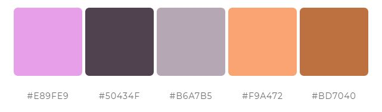

The data for this assignment is provided in the CodeClanData package.

* `qb_revenue_breakdown`
* `qb_monthly_sales`
* `qb_competitors`
* `qb_device_data`

Take a little time before you start to familiarise yourself with the data.

# Introductory ggplot2 Homework

```{r}
library(CodeClanData)
library(tidyverse)
```

```{r eval=FALSE, include=FALSE}
head(qb_revenue_breakdown)
str(qb_revenue_breakdown)

head(qb_monthly_sales)
str(qb_monthly_sales)

head(qb_revenue_breakdown)
str(qb_revenue_breakdown)

head(qb_competitors)
str(qb_competitors)
```

# MVP

## Part 1

**Question 1.**  
Take the data in the dataset `qb_revenue_breakdown` and make a stacked bar chart showing the sources of revenue across the two years in the dataset.
<br>
```{r}
#View(qb_revenue_breakdown)

ggplot(qb_revenue_breakdown) +
    geom_bar(aes(x = Year, y = Revenue, fill = Product), stat = "identity")
```


**Question 2.**  
Make a line chart showing monthly sales of the "flagship product" - the 'KwikBit Unit 1' - over the last year. This data is inside `qb_monthly_sales`, but you will need to use `filter()` or `subset()` (base `R)`.
<br>
```{r}
#View(qb_monthly_sales)

#qb_monthly_sales %>% 
#distinct(Cashflow)

qb_monthly_sales %>% 
  filter(Cashflow == "Kwikbit Unit 1 Sales") %>% 
  
  ggplot(aes(x = Date, y = Amount)) +
  geom_line()
```


**Question 3.**  
Make a line chart showing monthly revenue and costs over the last year. This data is also in `qb_monthly_sales`.								
<br>
```{r}
qb_monthly_sales %>% 
  filter(Cashflow == "Total Revenue" | 
           (Cashflow == "Cost")) %>% 
  
  ggplot(aes(x = Date, y = Amount, colour = Cashflow)) +
  geom_line()
```


**Question 4.**  
Show annual sales of personal fitness trackers over the last 5 years broken down by company as a ribbon plot (use `geom_area`). This data is in `qb_competitors`.
<br>
```{r}
#View(qb_competitors)
#head(qb_competitors)

qb_competitors %>% 
  ggplot(aes(x = Year, y = Revenue, fill = Company)) +
  geom_area()
```


**Question 5.**  
Now show the sales from the four competitors as a line graph. Include an extra layer that shows the data points used to make the lines.
<br>
```{r}

qb_competitors %>% 
  ggplot(aes(x = Year, y = Revenue, colour = Company)) +
  geom_line() +
  geom_point()
  
```


**Question 6.**  
Now the company wants to compare the number of steps that their device counts vs. their competitors. Make a line graph of the number of steps throughout time, and use faceting to compare between companies and people. The data for this is in `qb_device_data`.
<br>

```{r}
#View(qb_device_data)
#head(qb_device_data)
#qb_device_data %>% 
#  distinct(device)

device_with_time <- qb_device_data %>% 
  mutate(new_time = hours + (mins/60))

device_with_time %>% 
  ggplot(aes(x = new_time, y = counts, colour=device)) +
  geom_line() +
  facet_wrap(device ~ id)
```


## Part 2 

**Question 1.**  
Take the plots that you produced in part one and now polish them by:

1. Adding appropriate labels
2. Changing the scales and coordinates when appropriate.
3. Applying a unified theme, which is described below:
  * Graphs should have white backgrounds, and use colour sparingly.
  * There should be faint grid lines.
  * Font sizes should be ~12pt although titles should be slightly larger and axis labels can be slightly smaller. 
  * All plots should use colours from the following company colour scheme.

```{r, eval=TRUE, echo=FALSE, fig.cap="", out.width = '100%'}

```

```{r, echo=TRUE}
col_scheme <- c("#E89FE9", "#50434F", "#B6A7B5", "#F9A472", "#BD7040")
```