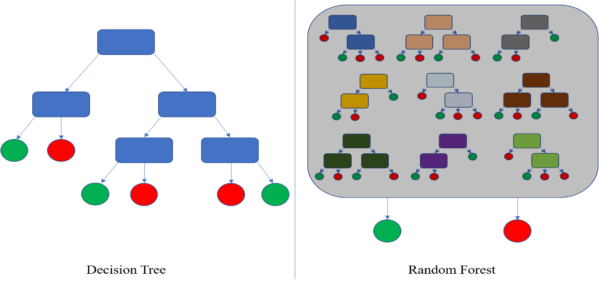

[Jeremybeauchamp, CC BY-SA 4.0](https://creativecommons.org/licenses/by-sa/4.0),
via Wikimedia Commons

**Decision Trees** are used for both classification and regression tasks. They are formed from nodes and branches, Nodes (blue rectangles on chart) are questions or choices to make between different features and branches (lines) are answers, The leaf nodes (circles) at the end are either classification between discrete categories or regression with numbers. The more nodes to process to get to a leaf result the greater the ‘depth’ of the tree. Trees are good for capturing expert domain knowledge where there is a known finite range of options/values. An example might be buying a car: electric/hybrid, if hybrid is chosen then choose petrol or diesel, 2/4 door, with sunroof or without, colour etc to eventually reach a particular model in the car maker inventory. Trees are flexible to adapt to however many real world categories are needed. Single trees can risk poorer accuracy and deeper trees can have poor performance as there are more computational decisions to be made. Considered simpler for humans to understand and visualise than many other methods, easy to keep audit trail of how decisions were made.

**Random Forests** also perform classification and regression of categories and numbers by combining  the results from dividing the data into random samples given to multiple trees. Can also be random features when trees are built. These are considered to be more accurate than single decision trees. Categories calculated by simple majority of leaf results, numbers by the mean values.
